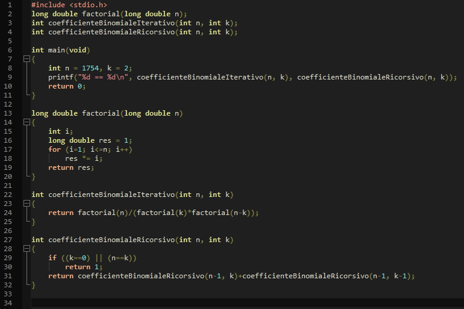

In caso di numeri grandi, possiamo quindi affermare che:

* La versione iterativa potrà, al più, processare fino al fattoriale di 1754 se si usa long double, 20 se long long.
* La versione ricorsiva può processare molti più numeri in quanto si tratta solo di una banale addizione
	e non di moltiplicazioni successive, ma è penalizzata dal fatto che fa un numero di chiamate ricorsive notevole.
