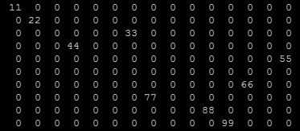
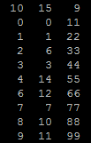

* Il numero di locazioni usate per allocare una matrice classica è uguale al numero di righe per colonne, quindi $O(righe \times colonne)$
* Il numero di locazioni usate per allocare una matrice sparsa equivalente alla classica è uguale al numero degli elementi utili (non-zero/non-nulli) moltiplicati per la grandezza della tripla ($n \times 3$) sommando infine l'indice, quindi $O((n+1) \times 3)$

Si ha quindi un risparmio di memoria usando una matrice sparsa quando gli elementi utili sono inferiori almeno al 32% degli elementi della matrice. Caso limite:

$$(\text{32 \% elementi utili}+\text{1 indice}) \times \text{3 grandezza tripla} = \text{99 \% rispetto a matrice classica}$$

Per quanto riguarda la complessità computazionale degli algoritmi di ricerca, abbiamo:

* Per quanto riguarda la matrice classica, si tratta di $O(righe \times colonne)$
* Per quanto riguarda la matrice sparsa, si tratta di $O(\text{elementi utili})$ quindi $O(n)$.

Nota: Le proporzioni sono state fatte in base ad una tripla formata da 3 campi `int`.
