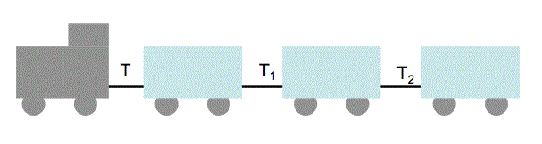
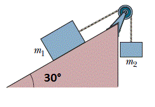
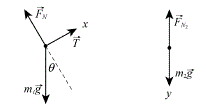

#Set Esercizi 4 - Quiz

_Scadenza 27 marzo 2017, 23:59. Le risposte numeriche approssimate entro il 5% sono considerate corrette._

_La precisione nei risultati è indicata con la virgola mobile (,) invece che col punto (.)._

_abs(num) e pow(num, esp) sono funzioni della console di python relativamente per trovare l'assoluto e la potenza di un numero._


##Domanda 1
Quanto vale la forza risultante, espressa in N, agente su un carrello di 2,6 Kg che procede con un'accelerazione di 3,5 $m/s^2$?

###Soluzione 1
9,1 (m e a variano)

```
m=6.2
a=9.3
F=m*a
```

$$F = ma$$


##Domanda 2
Un aereo a reazione parte da fermo dalla pista e accelera per il decollo a 3,6 $m/s^2$.
Possiede due motori a reazione ognuno dei quali esercita una spinta di 199,3 KN. Qual è il peso dell'aereo?

###Soluzione 2
(a e F cambiano)

```
a=3.9
F1=F2=276.0
m=a/(F1+F2)
```


##Domanda 3
Uno studente spinge una slitta di massa 31,7 Kg per 7,6 m lungo la superficie di un lago ghiacciato (si trascurino gli attriti).
Egli esercita una forza orizzontale costante di 128,2 N. Se la slitta parte da ferma, quale sarà la sua velocità finale (espressa in m/s)?

###Soluzione 3
(m d e F cambiano)


##Domanda 4
Un ascensore e il suo carico hanno una massa complessiva di 1376,5 Kg.
Si determini la tensione del cavo portante nel caso in cui l'ascensore, in moto originariamente verso l'alto alla velocità di 8,6 m/s,
viene fermato entro 42,3 m con decelerazione costante.

###Soluzione 4
(m a e d cambiano)

```
m=1242.6
v=12.3
a=pow(v,2)/(2*s)
T=Fp+ma = m(g+a)
```


##Domanda 5
Tre astronauti, muniti di zaino a reazione, spingono e guidano un asteroide di massa 19kg verso un banco di trattamento,
esercitando le forze indicate in figura $F_1$=29N, $F_2$=53N, $F_3$=45N, $\theta_1$=30°, e $\theta_3$=60°.
Qual è il modulo dell’accelerazione dell’asteroide lungo l'asse x (in $m/s^2$)?


###Soluzione 5


##Domanda 6
Una locomotiva traina tre vagoni su dei binari idealmente privi di attrito esercitando una forza T=4kN.
Le masse dei vagoni sono rispettivamente 13938 kg, 16258 kg e 14491 kg (partendo dal vagone agganciato alla locomotiva).
Calcolare la tensione $T_1$ (in kN) sul gancio che collega il primo al secondo vagone.



###Soluzione 6
(T m1 m2 m3 cambiano)


```
F=8
m1=15878
m2=11458
m3=10918
a=F/float(m1+m2+m3)
T=(m2+m3)*a
```


##Domanda 7
Spingete una pesante cassa di legno che striscia per terra.
Ad un certo punto rovesciate la cassa facendola poggiare su una faccia la cui superficie è metà della superficie iniziale.
Rispetto alla forza che esercitavate inizialmente,
la forza che dovrete esercitare per muovere la cassa alla stessa velocità che aveva prima di essere rovesciata è:

Scegli un'alternativa:

1. metà
2. quattro volte maggiore
3. un quarto
4. doppia
5. uguale

###Soluzione 7
5. uguale


##Domanda 8
Un blocco di massa $m_1$= 27,9 Kg sta su un piano inclinato di 30°, rispetto all'orizzontale.
Esso è collegato a un blocco di massa $m_2$= 12,8 Kg tramite una fune priva di massa che può scorrere su una carrucola priva di attrito.
Si determini l'accelerazione del blocco $m_1$ (espressa in $m/s^2$).




###Soluzione 8
-0,28 o -0,279


##Domanda 9
Un blocco di massa 18,7 Kg sta su un piano inclinato di 30°, rispetto all'orizzontale.
Esso è collegato a un blocco di massa 45,3 Kg tramite una fune priva di massa che può scorrere su una carrucola priva di attrito.
Si determini la tensione della fune (espressa in N).


###Soluzione 9
194,57 o 194,6

```
m2*(g-a)
```

